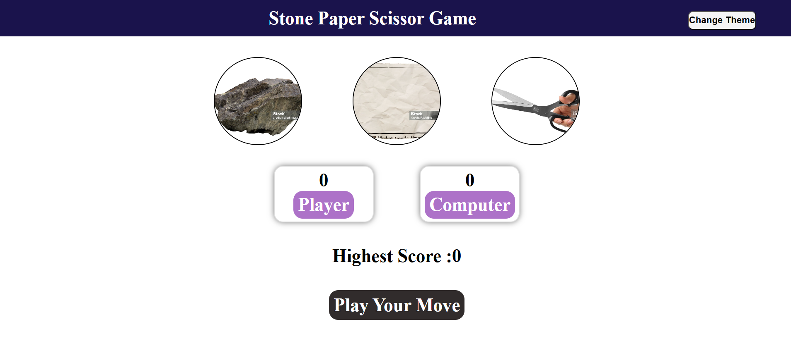

# 🪨📄✂️ Stone Paper Scissors Game

## 🎮 Description
The **Stone Paper Scissors** game is a web-based interactive game built using HTML, CSS, and JavaScript. This project allows users to play the classic "Rock, Paper, Scissors" game against the computer with additional functionalities to enhance the user experience.

## ✨ Features
- 🎨 **Theme Customization:** Users can change the theme of the game, including the icons for stone, paper, and scissors.
- 🏆 **Score Tracking:** The game saves the highest score achieved by the player.
- 📱 **Responsive Design:** The game is designed to work on different screen sizes.
- 🎭 **Theme Customization:** The game provides two different themes for the icons (Stone, Paper, Scissors), allowing users to personalize their experience.

## 🛠️ Technologies Used
- 🏗 **HTML** - Structure of the game.
- 🎨 **CSS** - Styling and layout.
- ⚙ **JavaScript** - Game logic and interactivity.

## 🎲 How to Play
1. 🔘 Choose one of the three options: **🪨 Stone, 📄 Paper, or ✂️ Scissors**.
2. 🤖 The computer will randomly choose an option.
3. 🏁 The winner is determined by the standard rules:
   - 🪨 **Stone beats Scissors** ✂️
   - ✂️ **Scissors beat Paper** 📄
   - 📄 **Paper beats Stone** 🪨
4. 📊 The score updates based on the results.
5. 🏅 The highest score is saved so you can track your progress.
6. 🎭 You can change the theme and icon styles for a personalized experience.

## 🚀 Installation and Setup
1. 📥 Download or clone the repository.
2. 🌐 Open the `index.html` file in your browser.
3. 🎉 Enjoy the game!

## 🔮 Future Enhancements
- 🔊 Adding sound effects.
- 🎭 Implementing a multiplayer mode.
- 🎨 More theme customization options.

## 🤝 Contributing
If you want to contribute to this project, feel free to fork the repository and submit a pull request.

## 📜 License
This project is open-source and free to use.

## 🖼️ Preview

---
🎮 **Enjoy playing the Stone Paper Scissors game!** 🚀

